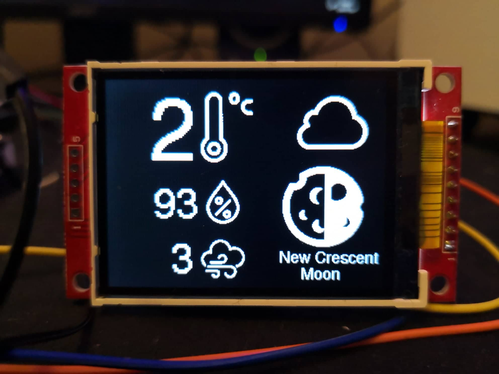
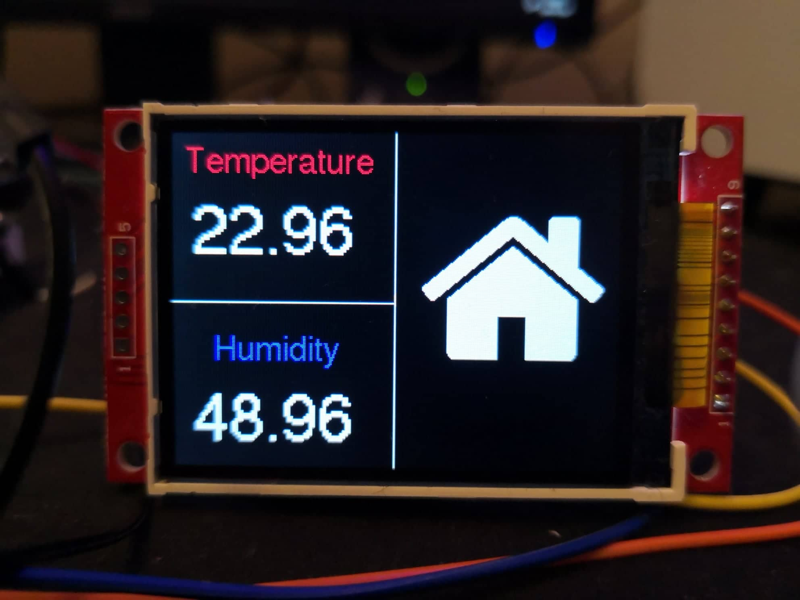

# NodeMCU-thermomether

Main goal was to create simpe thermometer which displays both, insides and outsides temperature. This device shows:
* Temperature outside
* Humidity outside
* Temperature inside
* Temperature inside
* Moon Phase
* Wind Speed
* What weather is outside (sunnny, cloudy, rainy)

There is some stuff that needs to be done:
1. Adding WIFI username and password possibility tu user
2. Change location possibility
3. Create box for screen and thermometer

Electric schema :
;

And now, the fun part, how all project looks like :)

Have a nice day ;)
